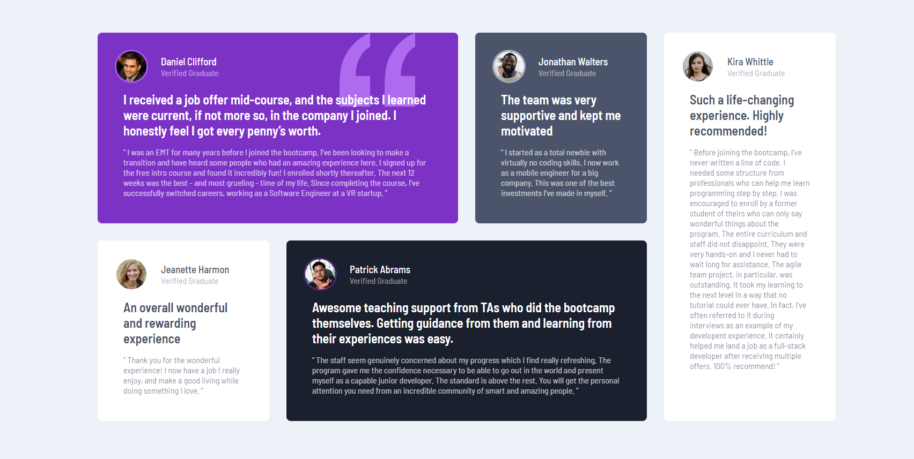
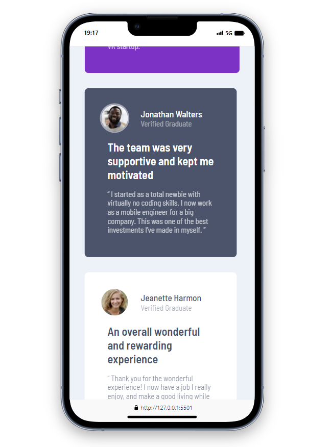

# Frontend Mentor - Testimonials Grid Section Main

This is a solution to the [Testimonials Grid Section Main](https://www.frontendmentor.io/challenges/testimonials-grid-section-Nnw6J7Un7). 

## Table of contents

- [Overview](#overview)
  - [The challenge](https://www.frontendmentor.io/challenges/testimonials-grid-section-Nnw6J7Un7)
  - [Screenshot](./images/web.png)
  - [Screenshot](./images/mobile.png)
- [Author](#author)

## Overview

### Screenshot

### Links

- Solution URL: [[https://github.com/rugarcia25/testimonials-grid-section-main](https://github.com/rugarcia25/testimonials-grid-section-main)] 
- Live Site URL: [[https://rugarcia25.github.io/testimonials-grid-section-main/](https://rugarcia25.github.io/testimonials-grid-section-main/)]

### Built with

- Semantic HTML5 markup
- CSS custom properties
- Flexbox
- CSS Grid
- Mobile-first workflow

## Author

- Website - [Rubén Garcia](https://rgdev.netlify.app/)
- Frontend Mentor - [@rugarcia25](https://www.frontendmentor.io/profile/rugarcia25)
- Github - [@rugarcia25](https://github.com/rugarcia25)